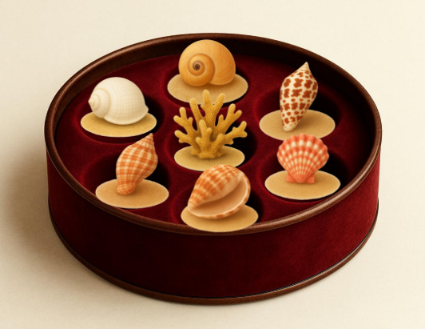
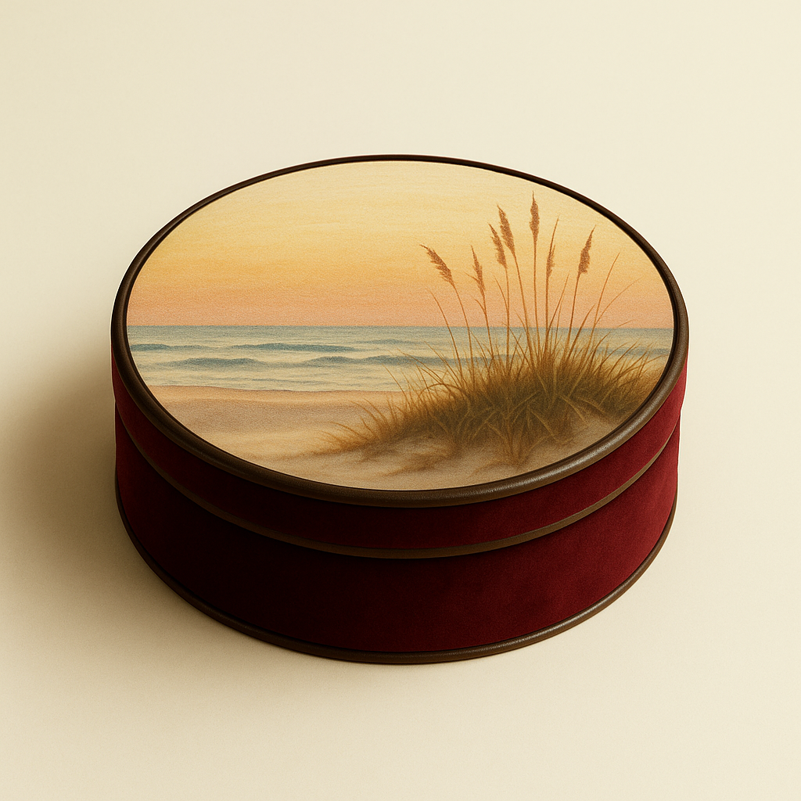
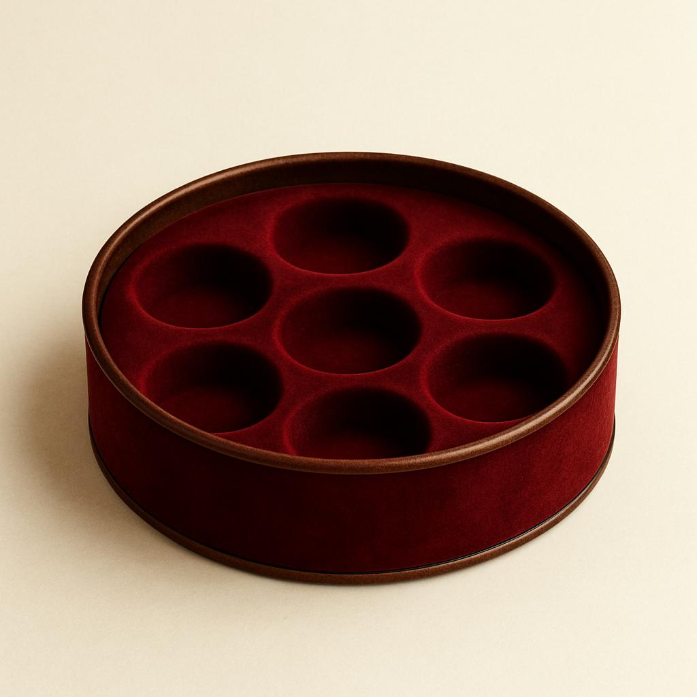
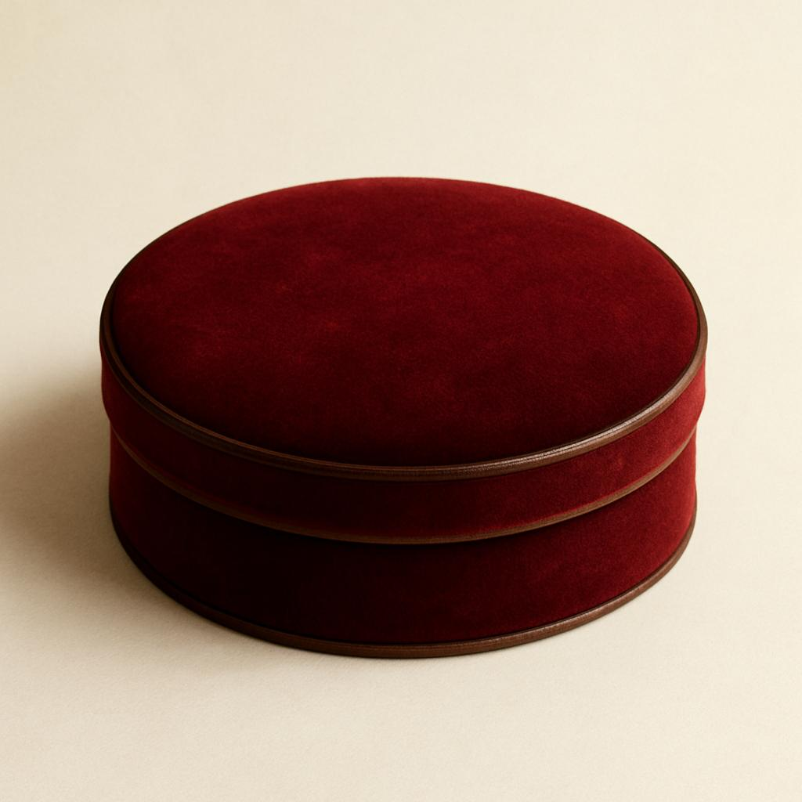
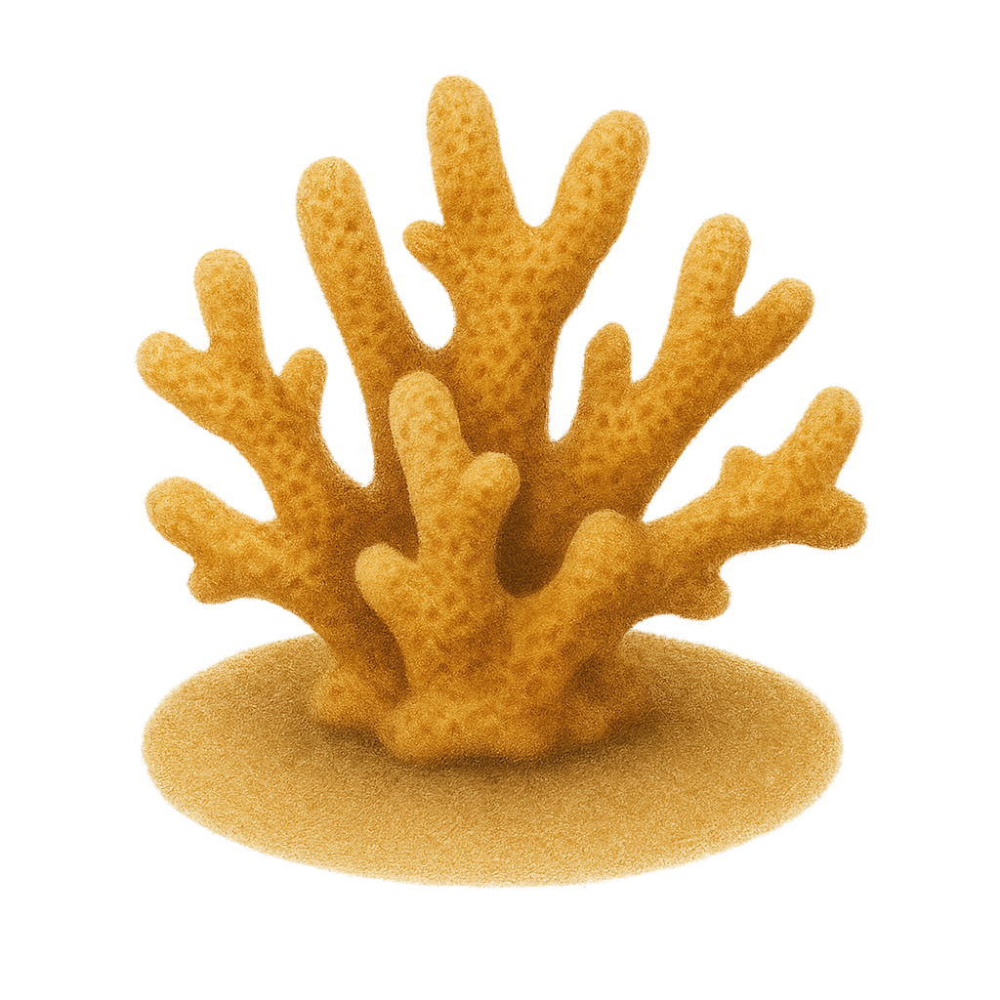

# Scriptorium

A beautiful interactive web application that displays boxes containing historical objects. Each object can be clicked to reveal detailed information and poetry.



## Features

- Interactive boxes with opening/closing functionality
- Carousel interface to navigate between multiple boxes
- Each box contains 7 clickable objects
- Click on objects to see detailed views with poetry in markdown format
- Responsive layout that works on both desktop and mobile devices

## Box Examples

### Closed Box


### Open Box with Objects


## Technologies Used

- React
- CSS for styling
- Supabase for backend storage and data management
- Markdown for poetry formatting

## Getting Started

### Prerequisites

- Node.js (version 14 or higher)
- npm or yarn
- Supabase account

### Installation

1. Clone the repository
```
git clone <repository-url>
cd scriptorium
```

2. Install dependencies
```
npm install
```

3. Create a `.env` file in the root directory with your Supabase credentials
```
REACT_APP_SUPABASE_URL=your_supabase_url
REACT_APP_SUPABASE_ANON_KEY=your_supabase_anon_key
```

### Supabase Setup

1. Create a new Supabase project
2. Create a table called `boxes` with the following columns:
   - `id` (int, primary key)
   - `name` (text) - The name/title of the box
   - `folder_name` (text) - Name of the folder in storage containing this box's assets
   - `created_at` (timestamp)

3. Create two storage buckets:
   - `object-images` - For storing box and object images
   - `object-texts` - For storing markdown text files

4. For each box, create a folder in both buckets with the box's `folder_name`
5. Add the following files to each box's folder:

   In the `object-images` bucket:
   - `box-base.jpg` - The open box image
   - `closed-box.png` - The closed box image
   - `img1.png` through `img7.png` - Images for the 7 objects in the box

   In the `object-texts` bucket:
   - `text1.md` through `text7.md` - Markdown files containing poetry/content for each object

### Running the Application

```
npm start
```

The application will be available at [http://localhost:3000](http://localhost:3000)

### Deployment

The application can be deployed to Netlify:

1. Build the application
```
npm run build
```

2. Deploy to Netlify using the Netlify CLI or by connecting your GitHub repository
3. Make sure to set the environment variables (REACT_APP_SUPABASE_URL and REACT_APP_SUPABASE_ANON_KEY) in your Netlify project settings

## Customization

### Adding New Boxes

1. Add a new record to the `boxes` table with a unique `folder_name`
2. Create folders with that name in both the `object-images` and `object-texts` buckets
3. Upload the required images and text files as described in the Supabase Setup section

### File Naming Conventions

- Box images: `box-base.jpg` (open box) and `closed-box.png` (closed box)
- Object images: `img1.png` through `img7.png`
- Text files: `text1.md` through `text7.md` (markdown format)

#### Image Examples
| Image Type | Example | 
|------------|---------|
| Open Box (`box-base.jpg`) |  |
| Closed Box (Plain) |  |
| Closed Box (with Design) |  |
| Sample Object (`img1.png`) |  |

### Sample Object Images

Box objects should be transparent PNG files with appropriate sizing. Here are examples of the 7 objects from a sample box:

<div style="display: flex; flex-wrap: wrap; gap: 10px;">
  
  
  
  
  
  
  
</div>

## Project Structure

```
scriptorium/
├── README.md
├── package.json
├── public/
│   ├── index.html
│   └── ...
└── src/
    ├── App.jsx
    ├── index.js
    ├── supabaseClient.js
    ├── components/
    │   ├── EggBox.jsx
    │   ├── EggBox.css
    │   ├── SimpleBoxCarousel.jsx
    │   └── BoxCarousel.css
```

## Markdown Format for Poems

The poetry text files should be in markdown format. Spacing between titles and stanzas has been optimized for poetry display. Use standard markdown formatting:

```markdown
# Poem Title

First stanza line 1
First stanza line 2
First stanza line 3

Second stanza line 1
Second stanza line 2
``` 